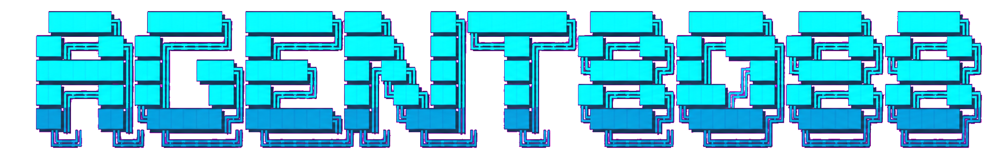

<p align="center">
  
  <br>
  
</p>

<p align="center">
  <strong>Reliable AI agents&mdash;even on small, local models.</strong>
</p>

<p align="center">
  An open-source agentic harness for reliable, verifiable task completion.<br>
  Grounded execution, robust context management, sandboxed tools, and transparent control&mdash;on your machine.
</p>

<p align="center">
  <strong>Small-model-first&nbsp;&nbsp;&middot;&nbsp;&nbsp;Research-backed reliability&nbsp;&nbsp;&middot;&nbsp;&nbsp;Execution you control</strong>
</p>

<p align="center">
  <a href="#quick-start">Quick start</a> ·
  <a href="#demo">Demo</a> ·
  <a href="#why-agent8088">Why Agent8088</a> ·
  <a href="#what-it-does">Features</a> ·
  <a href="#documentation">Documentation</a> ·
  <a href="#contributing">Contributing</a>
</p>

<p align="center">
  <a href="https://github.com/palindrome-rl/AGENT8088/actions/workflows/ci.yml"></a>
  <a href="LICENSE"></a>
  <a href="https://www.python.org/downloads/"></a>
  <a href="https://github.com/palindrome-rl/AGENT8088/tree/AGENT8088-v1.2"></a>
  
  
</p>

## Why Agent8088

Most agent harnesses are designed around large hosted models and optimistic
execution. Agent8088 starts from a different premise: useful agents should be
able to complete real work reliably with smaller models, limited context, and
explicit operational boundaries.

<table>
  <tr>
    <td width="33%" valign="top">
      <strong>Small-model-first</strong><br>
      <sub>Efficient prompts, minimized tool schemas, model-aware routing, and local-model support make capable local models practical.</sub>
    </td>
    <td width="33%" valign="top">
      <strong>Verification-gated completion</strong><br>
      <sub>Tasks are checked against their required outputs, tests, and observable tool results before completion is reported.</sub>
    </td>
    <td width="33%" valign="top">
      <strong>Grounded execution</strong><br>
      <sub>A persistent control loop plans, acts through structured tools, observes the result, and recovers when execution fails.</sub>
    </td>
  </tr>
  <tr>
    <td width="33%" valign="top">
      <strong>Robust context management</strong><br>
      <sub>Pre-call budgeting, overflow prevention, compaction, content handles, and persistent task state preserve what matters.</sub>
    </td>
    <td width="33%" valign="top">
      <strong>Transparent and controlled</strong><br>
      <sub>Permission modes, usage visibility, audit trails, credential protection, and OS-level sandboxing keep actions accountable.</sub>
    </td>
    <td width="33%" valign="top">
      <strong>Low-friction and extensible</strong><br>
      <sub>Use the CLI or web UI, connect local or hosted models, and extend the harness through MCP, skills, sub-agents, and gateways.</sub>
    </td>
  </tr>
</table>

Agent8088 is developed around measured failure modes rather than idealized
demos. Its reliability work is informed by regression testing, live workflow
analysis, academic research and community pain-points.

---

## Demo

<p align="center">
  <a href="assets/demo.mp4">
    
  </a>
</p>

## About

Agent8088 is an open-source AI agent harness by **Palindrome Research Labs**.
It reads files, runs tools, researches the web, and edits code through a
permission system you control. Its goal is not simply to produce an answer,
but to carry a task through execution, validation, and recovery when something
goes wrong. It is designed around the constraints that make real agent work
difficult: smaller models, limited context windows, unreliable tools, partial
results, and the need to prove that a requested outcome was actually produced.

Most agent harnesses assume a hosted model and trust the model by default. Agent8088 is built the other way round:

- **Local-first and context-aware.** It runs on your own machine with local Ollama models. `/models local` checks your hardware and suggests models that fit. Memory, OCR, and session history are stored on disk and never uploaded. Context budgeting and compaction help long tasks continue without silently overflowing the model window.
- **Verification before confidence.** Tool results, tests, expected deliverables, and execution state provide evidence for completion. Recovery paths help the agent retry, preserve useful progress, or surface a clear failure instead of pretending the task succeeded.
- **Guardrails built in.** Shell commands run in a native OS sandbox. Turn on `audit_log=1` and every tool call and approval decision is recorded in `audit.jsonl` in the agent's data folder (normally `~/.agent8088/`). Switch to `readonly` (`--mode readonly`) and writes, network access and shell commands each need your approval. Some safety rules are enforced in code, so a prompt can't switch them off.
- **One engine, many front ends.** The CLI, the web UI and the messaging gateway (Slack, Discord, WhatsApp, Telegram, email) share one agent loop, one session model and one permission layer.
- **Open by design.** Works with any OpenAI-compatible provider. It can use external MCP servers and can also serve its own tools over MCP. It supports skills and focused sub-agents, and all settings live in one plain-text config file.

<table>
  <tr>
    <td align="center" width="33%"><b>🛡️ Reliable by design</b><br><sub>Recovery, durable progress, context protection</sub></td>
    <td align="center" width="33%"><b>🔎 Transparent, safe, and controlled</b><br><sub>Permissions, usage visibility, audit trails</sub></td>
    <td align="center" width="33%"><b>⚙️ Execution grounded</b><br><sub>Structured tools and observable results</sub></td>
  </tr>
  <tr>
    <td align="center" width="33%"><b>✅ Verification gated</b><br><sub>Tests, deliverable checks, step verification</sub></td>
    <td align="center" width="33%"><b>🏠 Small-model-first</b><br><sub>Efficient tools, context budgets, local models</sub></td>
    <td align="center" width="33%"><b>🧩 Extensible</b><br><sub>MCP, skills, sub-agents, gateways</sub></td>
  </tr>
</table>

---

## What it does

| Capability | What it gives you |
| --- | --- |
| **Use the model you want** | 12 built-in provider profiles, local Ollama, Anthropic and custom OpenAI-compatible endpoints. Configure fallback models for retryable provider failures. |
| **Make smaller models practical** | Hardware-aware local-model recommendations, automatic model routing, hybrid tool selection, and on-demand tool schemas reduce unnecessary context and escalate only when a model is genuinely struggling. |
| **Work safely** | `full-auto` is the default, inside the workspace and the always-on safety floor; switch to `readonly` for per-action approval. One-time approvals, path zones, credential protection, SSRF and egress controls, command allowlists, and an audit trail are enforced in code. |
| **Plan before changing things** | `/plan` lets the agent investigate first, present a plan for approval, then carry it out. Optional audits use a read-only sub-agent to verify mutating work. |
| **Verify and recover** | Optional step verification checks mutating work, failed verification can restore the previous file state, and completion checks keep required deliverables from being silently skipped. |
| **Protect long-running work** | Context budgeting, automatic compaction, content handles, persistent trajectory state, and durable tasks help lengthy workflows retain their instructions and completed progress. |
| **Delegate without losing context** | Six restricted sub-agent profiles handle exploration, research, coding, test writing, verification, and general-purpose work in separate runs. |
| **Use tools without lock-in** | Built-in tools for files, shell, web research, browser access, scheduling, Git, sandboxed code, CLI-Anything, and more. Connect external MCP servers or expose Agent8088's safe tools to Codex, Claude Code, or Cursor. |
| **Read images without a vision model** | Attached screenshots and scanned PDFs are transcribed by a local OCR engine when the active model has no vision of its own. Multimodal models are untouched and keep using their own capability. |
| **Work across documents** | Read and process PDFs, Word documents, spreadsheets, and presentations, with checkpointed handling for larger files and OCR fallback for scanned content. |
| **Remember across sessions** | Durable facts about you and your projects are learned from finished turns and recalled automatically, using hybrid keyword + semantic search over a local SQLite store. Nothing leaves your machine. |
| **Stay in your workflow** | Use the interactive CLI or run a gateway for Slack, Discord, WhatsApp, Telegram, and email. Sessions and approvals follow the same engine and permission layer. |
| **Run contained commands** | Native OS sandboxing is preferred, with Docker as a fallback. Network access from sandboxed commands is off unless you allow it. |
| **Keep research current** | Search can use SearXNG, Tavily, Exa, or the bundled keyless DDGS fallback, with date-aware queries and the same network controls as every other outbound request. |
| **See what the agent is using** | Per-turn token and timing summaries, optional local cost telemetry, provider-limit indicators where supported, and audit logs make resource use and execution visible. |

---

## Quick start

### Install Agent8088 v1.2

The commands below install the public v1.2 branch. `agent8088 --update`
continues to use this branch.

**macOS, Linux, or WSL2**

```sh
curl -fsSL --proto '=https' --tlsv1.2 https://raw.githubusercontent.com/palindrome-rl/AGENT8088/AGENT8088-v1.2/install.sh | AGENT8088_BRANCH=AGENT8088-v1.2 bash
```

**Windows (PowerShell)**

```powershell
$env:AGENT8088_BRANCH = "AGENT8088-v1.2"; iex (irm https://raw.githubusercontent.com/palindrome-rl/AGENT8088/AGENT8088-v1.2/install.ps1)
```

Use these branch-specific installers for v1.2; the generic Pages installer
may track a different release.

The installer provisions an isolated Python environment, installs the global `agent8088` command, and can run the setup wizard. No administrator access is required for the base install.

<details>
<summary><b>What the installer provisions, and supported platforms</b></summary>

**What the installer provisions automatically:**

| Component | Linux / macOS | Windows |
| --- | --- | --- |
| Core agent (chat, tools, MCP, search) | yes | yes |
| Gateway adapters (Slack, Discord, WhatsApp, Telegram) | yes | yes |
| Playwright Chromium (`browse_page`) | yes | yes |
| Node.js 22 + WhatsApp bridge npm deps | yes | yes (portable, no admin) |
| Native sandbox runtime | yes (auto-setup) | hint only — needs an elevated terminal |

### Supported platforms

| Platform | Status | Notes |
|---|---|---|
| macOS 12+ (Apple Silicon & Intel) | Supported | `install.sh` |
| Ubuntu / Debian / Fedora / Arch (x64, arm64) | Supported | `install.sh` |
| WSL2 | Supported | `install.sh`; clone with LF line endings, not CRLF |
| Windows 10 (1903+) / 11, in Windows Terminal | Supported | `install.ps1` |
| Windows Server, legacy Console Host, PowerShell ISE | Not supported | needs a modern terminal host — see `install.ps1`'s terminal check |
| Alpine / other non-glibc Linux | Best-effort | works if bash, curl-or-wget, and Python 3.10+ are present |
| Corporate proxy (`HTTP_PROXY`/`HTTPS_PROXY`) | Supported | both installers honor standard proxy env vars |

</details>

After installing, start `agent8088` and run `/doctor [--fix]` to verify your setup, or
`/dump` to produce a bundle for a bug report.

The installers do not add the `[dev]` extra (pytest, ruff, pip-audit), and the
root Python `tests/` suite is not included in this release branch. Neither is
needed to install or run Agent8088.

### Configure and run

```sh
agent8088 --setup            # choose a provider, model, workspace, and search backend
agent8088                    # start the interactive agent
```

The setup wizard stores API keys in `~/.agent8088/.env` rather than `config.txt`. Start with a local Ollama model or select a hosted provider; the agent can switch models later with `/model` or `/models`.

> **Windows only:** the native sandbox runtime needs an elevated terminal to provision its restricted account + WFP egress filter. After install, open an elevated PowerShell and run `agent8088 --sandbox-setup`. On Linux and macOS the installer runs this automatically.

### Use the web UI

See the [Web UI CLI reference](docs/wiki/10-cli-reference.md#web-ui) for details.

```sh
agent8088 --web          # production build   -> http://127.0.0.1:8180
uv run agent8088 --web   # development (FastAPI + Vite) -> http://127.0.0.1:5180
```

The first source-checkout run needs `npm install` in `web`; production builds the frontend automatically when needed.

Web flags: `--web` · `--web-port PORT` · `--web-host HOST` · `--web-dev`

### A few useful commands

| Command | Purpose |
| --- | --- |
| `agent8088` | Start an interactive session. |
| `agent8088 --memory-setup` | Add the mem0 memory engine to an existing install (installs the backend deps and makes mem0 the default engine). The installers offer the same choice up front: `-WithMem0`/`-SkipMem0` (PowerShell) or `--memory mem0`/`--memory native` (bash), plus an interactive prompt. Switch engines any time with `/memory engine native\|mem0` — both stores are kept. |
| `agent8088 --uninstall` | Remove the install dir, config, env vars, and cron/scheduled-task entries. Add `--workspace` to also remove trace logs + WhatsApp session data, or `--dry-run` to preview first. |
| `agent8088 --gateway-setup` | Configure Slack, Discord, WhatsApp, Telegram, or email. |
| `agent8088 --gateway` | Run the messaging gateway. |
| `agent8088 --prompt-file PATH` | Run one unattended, full-auto task from a UTF-8 file. Use only in a trusted, isolated environment. |
| `agent8088 --mcp-serve` | Expose Agent8088's safe tools over MCP stdio. |
| `/plan <task>` | Research, propose a plan, and wait for your approval before mutations. |
| `/capabilities` | Show the live tool, MCP, sandbox, skill, sub-agent, and guardrail configuration. |
| `/cli-anything <task>` | Find, install, run, build, refine, test, or validate an application CLI through the experimental CLI-Anything integration. |
| `/doctor [--fix]` | Check local setup and report likely problems; `--fix` repairs a broken web-search install. |
| `/dump` | Write a redacted diagnostic bundle to disk, for sharing in a bug report. |

---

## How Agent8088 stays in control

Agent8088 has three permission modes:

| Mode | Behaviour |
| --- | --- |
| **`readonly`** | Read and inspect safely; request a one-time approval for writes, network access, scheduling, or non-safe shell commands. |
| **`full-auto`** *(default)* | Work without per-action prompts inside the configured workspace. The always-on safety floor still applies. |
| **`plan-only`** | Research and present a plan first; approved work then uses the regular permission path. |

Some actions are blocked in every mode: credential paths, shell startup-file writes, destructive Git operations such as `push` and `reset --hard`, and system-prompt exfiltration. See the [security guide](docs/wiki/03-permissions-and-security.md) for the exact boundaries and configuration.

<details>
<summary><b>CLI-Anything integration</b> <i>(experimental)</i></summary>

Agent8088 can use the [HKUDS CLI-Anything](https://github.com/HKUDS/CLI-Anything)
ecosystem without turning it into a second agent. Agent8088 remains responsible
for planning, permissions, sandboxing, and verification; application-specific
`cli-anything-*` commands run as subordinate adapters.

```text
/cli-anything find an existing CLI for image editing
/cli-anything use the GIMP harness to create a 1024x1024 project
/cli-anything build a harness for ./my-application
```

The bundled skill is lazy-loaded. CLI-Hub itself is installed only after first
use and approval, into an environment isolated from Agent8088's own Python
packages. Automatic package management is initially restricted to reviewed
Python harness entries; public npm, uv, bundled, and generic shell installers
remain visible for manual review. After installing a harness, Agent8088 loads
its packaged `SKILL.md` before execution so application-specific prerequisites
and command guidance remain available without eagerly expanding the prompt.

</details>

## CLI and messaging quick reference

The CLI and gateway share the same agent loop, session model, tool registry, and permission checks.

| Action | CLI | Messaging gateway |
| --- | --- | --- |
| Start a conversation | `agent8088` | Run `agent8088 --gateway`, then message an authorized account. |
| Start fresh or resume work | `/new`, `/sessions`, `/resume` | Per-chat and per-thread sessions persist automatically. |
| Change the model | `/model <provider:model>` or `/models` | `/model <provider:model>` |
| Inspect capabilities | `/capabilities` | `/capabilities` |
| Approve an action | Interactive terminal prompt | `/approve`, `/approve session`, or `/deny`; Discord also provides buttons. |
| Manage MCP servers | `/mcp`, `/mcp add`, `/mcp reload` | Available through the shared agent where appropriate. |

---

## Documentation

Optional [repository ingestion](docs/repository-ingestion.md) provides bounded
GitIngest-backed repository overviews, search and source reads.

The versioned [documentation wiki](docs/wiki/README.md) is the source of truth for this branch.
The [hosted v1.2 wiki](https://github.com/palindrome-rl/AGENT8088/wiki) mirrors
these versioned pages.

| Read this | To learn about |
| --- | --- |
| [Getting started](docs/wiki/01-getting-started.md) | Installation, setup, sandboxing, and first run. |
| [Permissions and security](docs/wiki/03-permissions-and-security.md) | Permission modes, approvals, sensitive paths, network controls, and safety floors. |
| [Tools](docs/wiki/04-tools.md) | Every built-in tool, aliases, web-search backends, and tool-selection rules. |
| [Model providers](docs/wiki/05-model-providers.md) | Provider profiles, custom endpoints, keys, and fallback chains. |
| [Memory](docs/wiki/16-memory.md) | What gets remembered, how hybrid retrieval works, and the `/memory` command. |
| [MCP](docs/wiki/07-mcp.md) | Connecting MCP servers and serving Agent8088 tools to other agents. |
| [Messaging gateway](docs/wiki/08-messaging-gateway.md) | Slack, Discord, WhatsApp, Telegram, and email setup. |
| [Skills and sub-agents](docs/wiki/09-skills-and-subagents.md) | Bundled profiles, isolation, skills, and personas. |
| [CLI reference](docs/wiki/10-cli-reference.md) | Flags and slash commands. |
| [Architecture](docs/wiki/11-architecture.md) | The agent loop, front ends, permissions, and state on disk. |
| [Testing and verification](docs/wiki/12-testing-and-verification.md) | Local test, feature-verification, and release checks. |

---

## Contributing

To inspect this release or propose a change, clone its public branch:

```sh
git clone --branch AGENT8088-v1.2 https://github.com/palindrome-rl/AGENT8088.git
cd AGENT8088
uv sync --all-extras
```

Read [CONTRIBUTING.md](CONTRIBUTING.md) to get started, the [full contribution guide](docs/wiki/14-contributing.md) for isolation rules and local verification, and the [Code of Conduct](CODE_OF_CONDUCT.md). The root unit-test suite is maintained outside this release branch. For security reports, use [private vulnerability reporting](SECURITY.md); never include credentials or exploit details in a public issue.

## License

[MIT](LICENSE)

<div align="center">
  
</div>
